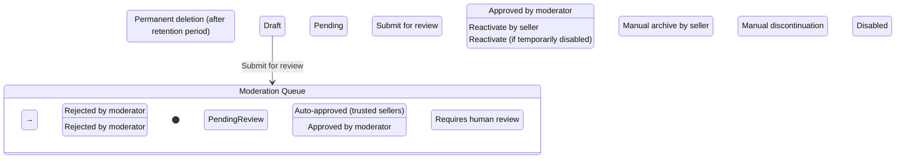
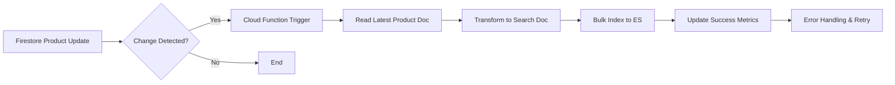

# FloodStore Marketplace Architecture

## 1. Complete Marketplace Architecture

Building upon FloodStore's existing Clean Architecture foundation, the Marketplace feature extends the current structure with a new `marketplace` feature module while preserving all existing architectural principles:

```
lib/
  features/
    marketplace/          # NEW FEATURE MODULE
      domain/             # Pure business logic (no Firebase/framework deps)
        entities/         # Product, Order, Cart, Review, etc.
        repositories/     # Abstract interfaces (ProductRepository, OrderRepository)
        services/         # Domain services (PricingService, RecommendationEngine)
      data/               # Firebase/Firestore implementations
        sources/          # Low-level data access
        repositories/     # Concrete implementations (FirestoreProductRepository)
        mappers/          # Entity <-> DTO conversion
      application/        # State management & business logic
        providers/        # Riverpod providers
        state/            # State classes
        use_cases/        # Application use cases
      presentation/       # UI layer
        screens/          # UI screens
        widgets/          # Reusable marketplace widgets
        themes/           # Marketplace-specific theme extensions
        constants/        # Marketplace-specific constants
```

### Key Architectural Decisions
- **Domain-Driven Design**: Clear bounded context for marketplace entities
- **CQRS Pattern**: Separate read/write models for product catalog (optimized for reads)
- **Event Sourcing Lite**: Order state transitions tracked via Firestore subcollections
- **Feature Toggles**: Remote config for gradual feature rollout
- **Backend-for-Frontend (BFF)**: Cloud Functions for complex aggregations
- **Multi-tenant Architecture**: Single Firestore instance with tenant isolation via document-level security

## 2. Firestore Database Schema

### Core Collections Structure
```
firestore/
├── users/{userId}                    # Extended from auth users
│   ├── profile                       # User profile document
│   ├── preferences                   # User preferences
│   ├── addresses                     # Subcollection: shipping/billing addresses
│   └── wallet                        # Wallet/balance information
│
├── products/{productId}              # Master product catalog
│   ├── base                          # Immutable product core data
│   │   └── metadata                  # Searchable metadata
│   ├── variants/{variantId}          # Product variants (size, color, etc.)
│   ├── inventory/{warehouseId}       # Inventory levels per location
│   ├── reviews/{reviewId}            # Product reviews (denormalized for reads)
│   └── analytics                     # Denormalized analytics counters
│
├── categories/{categoryId}           # Hierarchical category tree
│   └── children/{subCategoryId}      # Self-referential subcollection
│
├── carts/{userId}                    # Active shopping carts
│   └── items/{itemId}                # Cart items with snapshot pricing
│
├── orders/{orderId}                  # Order lifecycle management
│   ├── items/{itemId}                # Line items with priced snapshots
│   ├── payments                      # Payment attempts/subdocuments
│   ├── fulfillment                   # Shipping/tracking updates
│   └── history                       # Status change audit trail
│
├── sellers/{sellerId}                # Seller/profiles
│   ├── store                         # Store configuration
│   ├── products                      # Denormalized product references
│   ├── orders                        # Seller-specific order view
│   └── analytics                     # Seller performance metrics
│
├ promotions/{promoId}                # Discounts, coupons, sales
│   └── applicableTo                  # Products/categories this applies to
│
└ search_indexes/{indexId}            # Denormalized search-optimized views
```

### Document Structures

#### Product Base Document
```json
{
  "productId": "string",              
  "sellerId": "string",               
  "categoryId": "string",             
  "secondaryCategories": ["string"],  
  "base": {
    "title": "string",
    "description": "string",
    "brand": "string",
    "sku": "string",
    "weight": "number",
    "dimensions": {
      "length": "number",
      "width": "number",
      "height": "number"
    },
    "materials": ["string"],
    "careInstructions": "string",
    "isDigital": "boolean",
    "createdAt": "timestamp",
    "updatedAt": "timestamp",
    "status": "enum[draft, active, archived, discontinued]"
  },
  "metadata": {
    "tags": ["string"],
    "ageRange": {"min": "number", "max": "number"},
    "gender": "enum[male, female, unisex, kids]",
    "season": "enum[spring, summer, fall, winter, all]",
    "occasion": ["string"],
    "style": ["string"],
    "color": ["string"],
    "pattern": ["string"]
  },
  "pricing": {
    "basePrice": "number",
    "currency": "string",
    "compareAtPrice": "number",
    "taxCode": "string",
    "shippingTier": "string"
  }
}
```

#### Product Variant Document
```json
{
  "variantId": "string",
  "parentProductId": "string",
  "sku": "string",
  "attributes": {
    "string": "string"
  },
  "pricing": {
    "price": "number",
    "compareAtPrice": "number"
  },
  "inventory": {
    "total": "number",
    "reserved": "number",
    "warehouses": {
      "warehouseId": "number"
    }
  },
  "media": {
    "primary": "string",
    "gallery": ["string"],
    "videos": ["string"],
    "3dModel": "string"
  },
  "updatedAt": "timestamp"
}
```

#### Order Document
```json
{
  "orderId": "string",
  "userId": "string",
  "sellerId": "string",
  "status": "enum[pending, confirmed, processing, shipped, delivered, cancelled, returned]",
  "fulfillmentStatus": "enum[pending, picked, packed, shipped, out_for_delivery, delivered]",
  "paymentStatus": "enum[pending, authorized, captured, failed, refunded, partially_refunded]",
  "createdAt": "timestamp",
  "updatedAt": "timestamp",
  "placedAt": "timestamp",
  "completedAt": "timestamp",
  "subtotal": "number",
  "taxAmount": "number",
  "shippingAmount": "number",
  "discountAmount": "number",
  "totalAmount": "number",
  "currency": "string",
  "customerNotes": "string",
  "internalNotes": "string",
  "shippingAddress": {
    "name": "string",
    "line1": "string",
    "line2": "string",
    "city": "string",
    "state": "string",
    "postalCode": "string",
    "country": "string",
    "phone": "string"
  },
  "billingAddress": {
    // same structure as shippingAddress
  },
  "items": [
    {
      "itemId": "string",
      "productId": "string",
      "variantId": "string",
      "quantity": "number",
      "unitPrice": "number",
      "totalPrice": "number",
      "productTitle": "string",
      "variantAttributes": {
        "string": "string"
      }
    }
  ],
  "discounts": [
    {
      "promoId": "string",
      "code": "string",
      "type": "enum[percentage, fixed_amount, free_shipping]",
      "value": "number",
      "description": "string"
    }
  ],
  "payment": {
    "provider": "enum[stripe, paypal, apple_pay, google_pay]",
    "providerPaymentId": "string",
    "status": "string"
  },
  "tracking": {
    "carrier": "string",
    "trackingNumber": "string",
    "estimatedDelivery": "timestamp",
    "actualDelivery": "timestamp",
    "events": [
      {
        "timestamp": "timestamp",
        "status": "string",
        "location": "string",
        "description": "string"
      }
    ]
  },
  "history": [
    {
      "timestamp": "timestamp",
      "fromStatus": "string",
      "toStatus": "string",
      "changedBy": "string",
      "reason": "string",
      "notes": "string"
    }
  ]
}
```

## 3. Collections and Document Structure Details

### Users Collection Extensions
- `users/{userId}/profile`: Display name, avatar, bio, preferences
- `users/{userId}/addresses`: Address book with labels (home, work, etc.)
- `users/{userId}/wallet`: Store credit, gift card balances, loyalty points
- `users/{userId}/preferences`: Notification settings, newsletter subscriptions

### Products Collection Deep Dive
- **Denormalization Strategy**: Critical fields duplicated for read performance
- **Immutable Base**: Core product data rarely changes; versioned via `updatedAt`
- **Variant Isolation**: SKU-level pricing/inventory/media allows complex product configurations
- **Search Optimization**: `metadata` field contains denormalized, index-friendly attributes
- **Media Storage**: Actual files in Firebase Storage; Firestore stores references only
- **Inventory Management**: Real-time stock with reservation system for cart abandonment prevention

### Orders Collection Design
- **Event Sourcing Lite**: `history` subcollection provides complete audit trail
- **Denormalized Snapshots**: Product/pricing data captured at purchase time protects against price changes
- **Split Payment Ready**: `sellerId` field enables marketplace commission model
- **Fulfillment Tracking**: Granitary status tracking with carrier integration points
- **Tax/Jurisdiction Awareness**: Location-based tax calculation hooks

## 4. Security Rules Strategy

### Core Principles
- **Principle of Least Privilege**: Every rule grants minimum necessary access
- **Attribute-Based Access Control (ABAC)**: Roles and attributes drive permissions
- **Data Validation**: Server-side validation of all writes
- **Rate Limiting**: Abuse prevention at database level
- **Field-Level Security**: Sensitive fields (PII, payment) have stricter rules

### Rule Structure (Key Elements)
```javascript
rules_version = '2';
service cloud.firestore {
  match /databases/{database}/documents {
    
    // Helper functions
    function isSignedIn() { return request.auth != null; }
    function getUserRole(uid) { return get(/databases/$(database)/documents/users/$(uid)).data.role; }
    function isOwnUser(userId) { return request.auth.uid == userId; }
    function isAdmin() { return getUserRole(request.auth.uid) == "admin"; }
    function isSeller() { return getUserRole(request.auth.uid) == "seller"; }
    function isCustomer() { return getUserRole(request.auth.uid) == "customer"; }

    // Products collection rules
    match /products/{productId} {
      allow read: if true; // Public read access for catalog browsing
      allow create: if isSignedIn() && (isSeller() || isAdmin()) &&
                   request.resource.data.sellerId == request.auth.uid;
      allow update: if isSignedIn() && 
                   (get(/databases/$(database)/documents/products/$(productId)).data.sellerId == request.auth.uid ||
                    isAdmin()) &&
                   !request.resource.data.diff(resource.data).affectedKeys().hasAny(["sellerId", "productId"]);
      allow delete: if false; // Soft delete only via status field
      
      // Subcollection rules...
    }

    // Orders collection rules
    match /orders/{orderId} {
      allow read: if isSignedIn() && 
                 (resource.data.userId == request.auth.uid ||
                  resource.data.sellerId == request.auth.uid ||
                  isAdmin());
      allow create: if isSignedIn() && 
                   isCustomer() && // Only customers can create orders
                   request.resource.data.userId == request.auth.uid &&
                   request.resource.data.status == "pending";
      allow update: if isSignedIn() && 
                   (resource.data.userId == request.auth.uid ||
                    resource.data.sellerId == request.auth.uid ||
                    isAdmin()) &&
                   validOrderTransition(resource.data.status, request.resource.data.status) &&
                   validateOrderUpdate(resource.data, request.resource.data);
      allow delete: if false;
      
      // Helper functions for validation...
      
      // Subcollection rules...
    }

    // Similar rules for carts, users, sellers, promotions, system collections...
  }
}
```

## 5. Product Lifecycle

### States and Transitions


### Lifecycle Events and Triggers
1. **Product Creation**
   - Seller submits product in "Draft" status
   - Automatic validation of required fields
   - Initial media upload to Firebase Storage
   - Draft saved to Firestore with `status: draft`

2. **Moderation Flow** (for new sellers or high-risk categories)
   - Product moves to "Pending Review"
   - Trigger Cloud Function for automated checks:
     - Image moderation (Google Cloud Vision)
     - Profanity/spam detection
     - Brand/trademark checks
     - Prohibited item detection
   - If auto-approved: moves to "Active"
   - If flagged: moves to "Manual Review" queue

3. **Active State Operations**
   - Real-time inventory updates
   - Price/promotion adjustments
   - Variant additions/removals
   - SEO metadata updates
   - Sales analytics collection

4. **End-of-Life Transitions**
   - **Archived**: Removed from search/catalog but retained for order history
   - **Discontinued**: Permanent removal after grace period (existing orders fulfilled)
   - **Recalled**: Special status for safety/legal issues with customer notification workflow

5. **Analytics Events Tracked**
   - Product impression (when shown in search/listing)
   - Product click (when viewed)
   - Add to cart
   - Remove from cart
   - Purchase
   - Review submission
   - Return initiation

## 6. User Roles and Permissions

### Role Hierarchy
```
┌─────────────────┐
│    Super Admin  │ ◄─────┐
└─────────┬───────┘       │
          │               │
┌─────────▼───────┐       │
│   Platform Admin│       │
└─────────┬───────┘       │
          │               │
┌─────────▼───────┐       │
│   Store Manager │       │
└─────────┬───────┘       │
          │               │
┌─────────▼───────┐       │
│     Seller      │       │
└─────────┬───────┘       │
          │               │
┌─────────▼───────┐       │
│   Moderator     │───────┘
└─────────┬───────┘
          │
┌─────────▼───────┐
│   Customer      │
└─────────────────┘
```

### Role Definitions and Permissions

#### Customer (Default Role)
- **Can**: Browse catalog, search products, view product details, manage cart, create orders, view order history, manage profile/addresses, write product reviews, wishlist/favorites, initiate returns
- **Cannot**: Modify products, view other users' data, access admin/seller tools
- **Data Access**: Own profile, cart, orders, addresses, wishlist

#### Seller (Verified Business Accounts)
- **Inherits**: All Customer permissions
- **Additionally Can**: 
  - Create/update/delete own products
  - Manage own inventory
  - View analytics for own products
  - Manage own store profile
  - View orders containing their products (limited to line-item data)
  - Process refunds for their products (within policy)
  - Download sales reports
  - Manage promotions/coupons for their products
- **Cannot**: 
  - Modify other sellers' products
  - Access global analytics
  - Moderate content
  - Manage platform settings
- **Data Access**: Own products, own store data, order line items for their products, own analytics

#### Store Manager (Seller Sub-role)
- **Inherits**: All Seller permissions
- **Additionally Can**: 
  - Manage multiple stores under same business entity
  - Invite/manage staff accounts (limited permissions)
  - Configure store-level settings
  - Access consolidated store analytics
- **Cannot**: 
  - Modify platform-wide settings
  - Access other stores' data without explicit sharing

#### Moderator (Trust & Safety)
- **Can**: 
  - Review reported products/reviews/users
  - Approve/reject product listings
  - Temporarily hide/disable problematic content
  - Contact users regarding policy violations
  - View moderation queues and audit logs
  - Issue warnings/temporary suspensions
- **Cannot**: 
  - Modify product data directly
  - Access financial/payment information
  - Change user roles
  - Access global sales data

#### Platform Administrator
- **Can**: 
  - All Moderator capabilities
  - Manage user roles and permissions
  - Configure platform settings (fees, taxes, policies)
  - View global analytics and reports
  - Manage payment gateway configurations
  - Create/maintain promotional campaigns
  - Perform data exports/audits
  - Emergency system controls (maintenance mode)
- **Cannot**: 
  - Modify core system security rules (requires DevOps)
  - Access raw payment processor keys (secrets management)

#### Super Administrator (System Owner)
- **Full system access** including:
  - Infrastructure configuration
  - Security policy modification
  - Billing/account management
  - Data export/migration capabilities
  - Emergency override capabilities

### Role Assignment Logic
- **New Users**: Automatically assigned `customer` role
- **Seller Application**: 
  1. User applies via seller portal
  2. Identity verification (KYC/AML checks)
  3. Business verification (tax ID, business license)
  4. Manual review by trust & safety team
  5. Upon approval: role changed to `seller`
- **Moderator/Promotion**: 
  - Invited by existing admins
  - Requires background check and NDA
  - Role granted via internal admin tool
- **Admin Roles**: 
  - Granted only to trusted employees
  - Require MFA and hardware security keys
  - Subject to access logging and audit trails

## 7. Navigation Flow

### Information Architecture
```
Home (Marketplace Shell)
├── Explore (/explore)
│   ├── Categories (/explore/categories)
│   │   └── Category Detail (/explore/category/:categoryId)
│   ├── Search (/explore/search?q=...)
│   │   ├── Filters (/explore/search?filters=...)
│   │   └── Sort Options
│   ├── Trending (/explore/trending)
│   └── Recommendations (/explore/recommendations)
├── Shop (/shop)  // Personalized storefront
│   ├── Following (/shop/following)
│   │   └── Seller Store (/shop/seller/:sellerId)
│   ├── Collections (/shop/collections)
│   │   └── Collection Detail (/shop/collection/:collectionId)
│   └── History (/shop/history)
├── Cart (/cart)
├── Orders (/orders)
│   ├── Order Detail (/orders/:orderId)
│   │   ├── Tracking (/orders/:orderId/tracking)
│   │   └── Return/Exchange (/orders/:orderId/return)
│   ├── Order History (/orders/history)
│   └── Reorder (/orders/:orderId/reorder)
├── Profile (/profile)
│   ├── Account (/profile/account)
│   │   ├── Security (/profile/account/security)
│   │   └── Notifications (/profile/account/notifications)
│   ├── Addresses (/profile/addresses)
│   │   └── Add/Edit Address (/profile/addresses/add)
│   ├── Wallet (/profile/wallet)
│   │   ├── Transaction History (/profile/wallet/history)
│   │   └── Add Funds (/profile/wallet/add-funds)
│   └── Order History (/profile/orders)
└── Seller Center (if seller role) (/seller)
    ├── Dashboard (/seller/dashboard)
    ├── Products (/seller/products)
    │   ├── Add Product (/seller/products/add)
    │   └── Edit Product (/seller/products/:productId/edit)
    ├── Orders (/seller/orders)
    │   └── Order Detail (/seller/orders/:orderId)
    ├── Analytics (/seller/analytics)
    │   ├── Sales (/seller/analytics/sales)
    │   ├── Traffic (/seller/analytics/traffic)
    │   └── Customers (/seller/analytics/customers)
    ├── Store Settings (/seller/store-settings)
    └── Payouts (/seller/payouts)
```

### Navigation Patterns
- **Primary Navigation**: Persistent bottom navigation (mobile) / side drawer (web/desktop)
  - Home | Explore | Cart | Orders | Profile (+ Seller if applicable)
- **Secondary Navigation**: Contextual top tabs or side menus within sections
- **Breadcrumbs**: Shown on all deep-linkable screens for context
- **Search Persistence**: Search query and filters preserved in URL for sharing/bookmarking
- **Deep Linking**: All major screens accessible via direct URLs
- **Guest Checkout**: Optional account creation post-purchase with data persistence

### State Preservation
- **Navigation State**: Scroll position, filters, sort order preserved via router state
- **Form State**: Draft saves using existing DraftStorageService
- **Authentication State**: Persisted via Firebase Auth + silent refresh
- **Cart State**: Persisted in Firestore with local cache for offline support
- **Search History**: Stored in Firestore with TTL (30 days)

### Error and Empty States
- **Empty States**: Illustrated guidance with clear CTAs
- **Loading States**: Skeleton loaders for content, spinners for actions
- **Error States**: Retry mechanisms with exponential backoff
- **Network Offline**: Clear indication with queue indicator for pending actions
- **Permissions**: Graceful degradation with permission request prompts

## 8. Folder Structure Following Existing Clean Architecture

### Marketplace Feature Structure
```
lib/
  features/
    marketplace/
      ├── assets/                 # Marketplace-specific assets (icons, illustrations)
      │   ├── icons/
      │   └── illustrations/
      │
      ├── data/                   # Firebase/Firestore implementations
      │   ├── sources/            # Low-level data access
      │   │   ├── firestore/      # Firestore collections
      │   │   │   ├── products.dart
      │   │   │   ├── orders.dart
      │   │   │   ├── users.dart
      │   │   │   └── carts.dart
      │   │   └── storage/        # Firebase Storage references
      │   │       └── product_images.dart
      │   │
      │   ├── repositories/       # Concrete repository implementations
      │   │   ├── product_repository_impl.dart
      │   │   ├── order_repository_impl.dart
      │   │   ├── cart_repository_impl.dart
      │   │   └── user_repository_impl.dart
      │   │
      │   └── mappers/            # Entity <-> DTO conversion
      │       ├── product_mapper.dart
      │       └── order_mapper.dart
      │
      ├── domain/                 # Pure business logic
      │   ├── entities/           # Core business objects
      │   │   ├── product.dart
      │   │   ├── product_variant.dart
      │   │   ├── order.dart
      │   │   ├── cart.dart
      │   │   ├── user.dart
      │   │   ├── review.dart
      │   │   ├── promotion.dart
      │   │   └── category.dart
      │   │
      │   ├── repositories/       # Abstract repository interfaces
      │   │   ├── product_repository.dart
      │   │   ├── order_repository.dart
      │   │   ├── cart_repository.dart
      │   │   └── user_repository.dart
      │   │
      │   ├── services/           # Domain services (stateless business logic)
      │   │   ├── pricing_service.dart
      │   │   ├── recommendation_engine.dart
      │   │   ├── inventory_service.dart
      │   │   └── search_service.dart
      │   │
      │   ├── use_cases/          # Application business rules
      │   │   ├── get_products_use_case.dart
      │   │   ├── add_to_cart_use_case.dart
      │   │   ├── place_order_use_case.dart
      │   │   ├── search_products_use_case.dart
      │   │   └── get_recommendations_use_case.dart
      │   │
      │   ├── models/             # Domain-specific enums, typedefs, exceptions
      │   │   ├── product_enums.dart
      │   │   ├── order_enums.dart
      │   │   └── exceptions.dart
      │   │
      │   └── validators/         # Input validation
      │       ├── product_validator.dart
      │       └── order_validator.dart
      │
      ├── application/            # State management & app logic
      │   ├── providers/          # Riverpod providers
      │   │   ├── product_provider.dart
      │   │   ├── cart_provider.dart
      │   │   ├── order_provider.dart
      │   │   ├── search_provider.dart
      │   │   └── recommendation_provider.dart
      │   │
      │   ├── state/              # State objects
      │   │   ├── product_state.dart
      │   │   ├── cart_state.dart
      │   │   ├── order_state.dart
      │   │   └── search_state.dart
      │   │
      │   └── notifiers/          # State notifiers (StateNotifier)
      │       ├── product_notifier.dart
      │       ├── cart_notifier.dart
      │       ├── order_notifier.dart
      │       └── search_notifier.dart
      │
      └── presentation/           # UI layer
          ├── screens/            # Full-screen views
          │   ├── home/
          │   │   └── marketplace_home_screen.dart
          │   ├── explore/
          │   │   ├── explore_screen.dart
          │   │   ├── category_screen.dart
          │   │   └── search_screen.dart
          │   ├── shop/
          │   │   ├── shop_screen.dart
          │   │   ├── seller_store_screen.dart
          │   │   └── collection_screen.dart
          │   ├── product/
          │   │   ├── product_list_screen.dart
          │   │   └── product_detail_screen.dart
          │   ├── cart/
          │   │   └── cart_screen.dart
          │   ├── orders/
          │   │   ├── orders_screen.dart
          │   │   └── order_detail_screen.dart
          │   ├── profile/
          │   │   ├── profile_screen.dart
          │   │   ├── address_screen.dart
          │   │   └── wallet_screen.dart
          │   └── seller/
          │       ├── seller_dashboard_screen.dart
          │       ├── product_management_screen.dart
          │       └── order_management_screen.dart
          │
          ├── widgets/            # Reusable marketplace widgets
          │   ├── product_card.dart
          │   ├── product_grid.dart
          │   ├── product_list.dart
          │   ├── price_tag.dart
          │   ├── rating_stars.dart
          │   ├── add_to_cart_button.dart
          │   ├── shop_header.dart
          │   ├── skeleton_loader.dart
          │   └── empty_state.dart
          │
          ├── themes/             # Marketplace-specific theme extensions
          │   └── marketplace_theme.dart
          │
          └── constants/          # Marketplace-specific constants
              ├── routes.dart
              └── limits.dart
```

### Integration Points with Existing Architecture
1. **Reuses Existing Providers**:
   - `authRepositoryProvider` from `features/auth/application/providers/auth_providers.dart`
   - Firebase app initialization from `main.dart`

2. **Shares UI Components**:
   - `GlassCard`, `PremiumButton`, `PremiumTextField` from `core/widgets/`
   - `AuthShell` pattern adapted for marketplace layouts
   - `BreathingLogo`, `ParticleBackground` for branded experiences

3. **Leverages Existing Services**:
   - `AuthRateLimiter` for authentication endpoints
   - `SecureTokenService` for sensitive token storage
   - `SessionService` for activity tracking

4. **Extends Routing**:
   - New routes added to `core/router/app_router.dart`
   - Auth guards extended for marketplace-specific protections
   - Deep linking handled via existing GoRouter setup

## 9. Entity Relationship Diagram

```
┌─────────────┐    ┌──────────────┐    ┌──────────────┐
│   Users     │    │   Products   │    │  Categories  │
├─────────────┤    ├──────────────┤    ├──────────────┤
│ userId (PK) │    │ productId (PK) │    │ categoryId (PK)│
│ email       │    │ sellerId (FK)  │    │ name         │
│ role        │    │ title          │    │ parentId (FK)│
│ createdAt   │    │ description    │    │ level        │
│ ...         │    │ base.price     │    │ sortOrder    │
└─────────────┘    │ base.status   │    └──────────────┘
                   │ metadata      │
                   │ variants      │◄─────┘
                   │ inventory     │
                   └──────────────┘
                         ▲
                         │
          ┌──────────────┴───────────────┐
          ▼                              ▼
┌─────────────┐                    ┌──────────────┐
│ Product     │                    │ Product      │
│ Variants    │                    │ Inventory    │
├─────────────┤                    ├──────────────┤
│ variantId   │                    │ warehouseId  │
│ productId   │                    │ quantity     │
│ sku         │                    │ reserved     │
│ attributes  │                    └──────────────┘
│ pricing     │
│ media       │
└─────────────┘
                         ▲
                         │
          ┌──────────────┴───────────────┐
          ▼                              ▼
┌─────────────┐                    ┌──────────────┐
│   Orders    │                    │   Reviews    │
├─────────────┤                    ├──────────────┤
│ orderId     │                    │ reviewId     │
│ userId (FK) │                    │ productId (FK)│
│ sellerId (FK)│                   │ userId (FK)  │
│ status      │                    │ rating       │
│ totalAmount │                    │ comment      │
│ items       │                    │ createdAt    │
│ payments    │                    └──────────────┘
│ shipping    │
│ timestamps  │
└─────────────┘
                         ▲
                         │
          ┌──────────────┴───────────────┐
          ▼                              ▼
┌─────────────┐                    ┌──────────────┐
│   Order     │                    │   Promotions │
│   Items     │                    ├──────────────┤
├─────────────┤                    │ promoId      │
│ itemId      │                    │ code         │
│ orderId (FK)│                    │ type         │
│ productId   │                    │ value        │
│ variantId   │                    │ startDate    │
│ quantity    │                    │ endDate      │
│ unitPrice   │                    │ targetType   │
│ totalPrice  │                    │ targetIds    │
└─────────────┘                    └──────────────┘
```

### Relationship Cardinality Notes
- **Users 1:∞ Products**: One seller can have many products
- **Users 1:∞ Orders**: One user can place many orders
- **Users 1:∞ Reviews**: One user can write many reviews
- **Products 1:∞ Variants**: One product can have many variants (SKUs)
- **Products 1:∞ Inventory**: Product inventory tracked per warehouse
- **Products M:∞ Categories**: Products can belong to multiple categories
- **Categories 1:∞ Subcategories**: Hierarchical category tree
- **Orders 1:∞ Items**: One order contains many line items
- **Orders 1:∞ Payments**: Multiple payment attempts possible
- **Products 1:∞ Reviews**: Products can receive many reviews
- **Promotions M:∞ Products**: Promotions can apply to many products

## 10. Feature Roadmap with Dependencies

### Phase 0: Foundation (Prerequisites)
*Dependencies: None (builds on existing auth infra)*

| Feature | Description | Dependencies | Estimated Effort |
|---------|-------------|--------------|------------------|
| Firebase Firestore Setup | Enable Firestore, configure indexes, security rules baseline | Existing Firebase project | 2 days |
| Product Domain Models | Define Product, Variant, Category entities with validation | None | 3 days |
| Order Domain Models | Define Order, Item, Payment entities | None | 2 days |
| Cart Domain Models | Define Cart, Item entities | None | 1 day |
| Repository Interfaces | Abstract ProductRepository, OrderRepository, CartRepository | Domain models | 2 days |
| Firestore Implementation | Concrete implementations of repository interfaces | Repository interfaces, Firebase setup | 5 days |
| Basic Product Listing | Read products from Firestore, display in grid | Product repository | 3 days |

### Phase 1: Core Catalog Functionality
*Dependencies: Phase 0*

| Feature | Description | Dependencies | Estimated Effort |
|---------|-------------|--------------|------------------|
| Product Detail Screen | Full product view with variants, media, description | Product repository | 4 days |
| Product Search | Text search with basic filtering | Product repository | 3 days |
| Category Browsing | Hierarchical category navigation | Product repository | 2 days |
| Product Filters | Price, rating, brand, attribute filters | Product repository | 2 days |
| Sorting Options | Price, relevance, newest, best-selling | Product repository | 1 day |
| Infinite Scroll/Pagination | Efficient large dataset loading | Product repository | 2 days |
| Product Loading States | Skeletons, error handling, retry | Product repository | 1 day |

### Phase 2: Shopping Cart & Checkout
*Dependencies: Phase 1*

| Feature | Description | Dependencies | Estimated Effort |
|---------|-------------|--------------|------------------|
| Cart Management | Add/remove items, quantity updates | Cart repository, Product repository | 3 days |
| Cart Persistence | Firestore-backed cart with sync | Cart repository | 2 days |
| Mini Cart UI | Header cart icon with badge | Cart provider | 1 day |
| Save for Later | Move items to wishlist | Cart repository, Wishlist feature | 2 days |
| Estimated Totals | Subtotal, tax, shipping, discounts | Cart repository, Pricing service | 2 days |
| Checkout Initiation | Validate cart, proceed to payment | Cart repository, Order service | 1 day |
| Guest Checkout Flow | Optional account creation post-purchase | Auth service, Order service | 3 days |

### Phase 3: Payment & Order Management
*Dependencies: Phase 2*

| Feature | Description | Dependencies | Estimated Effort |
|---------|-------------|--------------|------------------|
| Payment Integration | Stripe/PayPal SDK integration | Order service | 5 days |
| Payment Webhooks | Handle async payment confirmation | Order service | 2 days |
| Order Creation | Convert cart to order with inventory lock | Cart service, Order service, Inventory service | 3 days |
| Order Confirmation | Email/SMS receipt, order summary | Order service, Notification service | 2 days |
| Order History | View past orders with filtering | Order repository | 2 days |
| Order Details | Full order view with tracking | Order repository | 2 days |
| Invoice Generation | PDF invoice download | Order service | 2 days |

### Phase 4: User Accounts & Profiles
*Dependencies: Phase 3*

| Feature | Description | Dependencies | Estimated Effort |
|---------|-------------|--------------|------------------|
| User Profile | Edit profile, avatar, bio | User repository | 2 days |
| Address Book | Save/edit shipping/billing addresses | User repository | 2 days |
| Payment Methods | Save cards (via payment gateway tokens) | User repository, Payment service | 3 days |
| Order Notifications | Email/SMS for order status changes | Order service, Notification service | 2 days |
| Wishlist/Favorites | Save products for later | User repository, Product repository | 2 days |
| Recently Viewed | Track product view history | User repository | 1 day |
| Account Deletion | GDPR-compliant data removal | User service | 2 days |

### Phase 5: Seller Functionality
*Dependencies: Phase 3*

| Feature | Description | Dependencies | Estimated Effort |
|---------|-------------|--------------|------------------|
| Seller Onboarding | Application, verification, approval flow | User service, Admin service | 5 days |
| Product Management | Create/edit products with variants | Product repository | 4 days |
| Inventory Management | Stock levels, low-stock alerts | Inventory service | 3 days |
| Order Management | View/fulfill orders containing their products | Order repository | 3 days |
| Sales Dashboard | Revenue, units sold, top products | Order service, Analytics service | 3 days |
| Payout Management | Transaction history, payout requests | Payment service | 2 days |
| Store Configuration | Shop name, description, policies, branding | User repository | 2 days |
| Promotion Creation | Create coupons, sales for own products | Promotion service | 2 days |

### Phase 6: Discovery & Personalization
*Dependencies: Phase 1*

| Feature | Description | Dependencies | Estimated Effort |
|---------|-------------|--------------|------------------|
| Personalized Recommendations | Collaborative filtering, content-based | Recommendation engine, User/product data | 5 days |
| Trending/Popular Algorithms | Real-time popularity scoring | Analytics service | 3 days |
| "Customers Also Bought" | Association rule mining | Order history data | 3 days |
| Recently Viewed Section | Based on user history | User service | 1 day |
| Email/Push Notifications | Abandoned cart, price drops, restocks | Notification service | 3 days |
| Search Autocomplete | Real-time suggestions as user types | Search service | 2 days |
| Saved Searches | Alerts for new matching products | User service, Search service | 2 days |

### Phase 7: Trust & Safety
*Dependencies: Phase 1*

| Feature | Description | Dependencies | Estimated Effort |
|---------|-------------|--------------|------------------|
| Product Reviews | Star ratings, text reviews, photos | Review service | 3 days |
| Review Moderation | Spam, inappropriate content detection | Moderation service | 2 days |
| Seller Ratings | Overall score, response time, shipping accuracy | Order service | 2 days |
| Return/Refund System | Initiate returns, process refunds | Order service, Payment service | 4 days |
| Dispute Resolution | Mediation workflow for buyer/seller conflicts | Support system | 3 days |
| IP Protection | Reporting counterfeit/IP infringement | Legal workflow | 2 days |
| Age/Restriction Gating | Verify age for restricted products | User service, Product service | 2 days |

### Phase 8: Analytics & Admin
*Dependencies: Phase 3*

| Feature | Description | Dependencies | Estimated Effort |
|---------|-------------|--------------|------------------|
| Admin Dashboard | Sales, traffic, user metrics | Analytics service | 4 days |
| Seller Analytics | Per-seller performance metrics | Order service | 3 days |
| Inventory Forecasting | Predictive stock replenishment | Inventory service, Sales data | 3 days |
| A/B Testing Framework | Experimentation platform | Feature flag service | 3 days |
| Customer Segmentation | RFM analysis, behavior targeting | User service, Order service | 3 days |
| Loyalty Program | Points, rewards, tiered benefits | User service, Payment service | 3 days |
| Tax/VAT Automation | Jurisdiction-based tax calculation | Tax service (Avalara/TaxJar) | 4 days |
| Multi-Currency Support | Currency conversion, pricing localization | Pricing service, FX API | 3 days |

### Phase 9: Performance & Scale
*Dependencies: All previous phases*

| Feature | Description | Dependencies | Estimated Effort |
|---------|-------------|--------------|------------------|
| CDN for Static Assets | Global asset delivery | Firebase Hosting | 1 day |
| Image Optimization | Automatic resizing, compression, WebP | Storage service | 2 days |
| Query Optimization | Composite indexes, denormalization strategies | Firestore | 3 days |
| Caching Layers | Memory cache (LRU), Redis for frequent queries | State management | 3 days |
| Batch Operations | Bulk product imports/exports | Admin service | 2 days |
| Webhooks & Events | Real-time sync with external systems | Cloud Functions | 3 days |
| Load Testing & Optimization | Simulate Black Friday traffic | Monitoring tools | 3 days |
| Disaster Recovery | Backup/restore procedures | Infrastructure | 2 days |

## 11. Performance Strategy

### Performance Budgets
- **Time to First Byte (TTFB)**: < 800ms (95th percentile)
- **First Contentful Paint (FCP)**: < 1.2s (95th percentile)
- **Largest Contentful Paint (LCP)**: < 2.5s (95th percentile)
- **Time to Interactive (TTI)**: < 3.5s (95th percentile)
- **API Response Time**: < 200ms (95th percentile for cached data)
- **Database Query Time**: < 100ms (95th percentile for indexed queries)

### Optimization Strategies

#### Frontend Performance
1. **Code Splitting**
   - Lazy-load feature modules via `LazyLoad` widget
   - Route-based code splitting for major screens
   - Separate bundles for web/mobile if needed

2. **Asset Optimization**
   - WebP image format with quality 80-85
   - Responsive images (`srcset`) for different screen densities
   - SVG for icons and simple illustrations
   - Font subsetting (only used glyphs)
   - Critical CSS inlining

3. **Rendering Optimization**
   - `const` constructors for immutable widgets
   - `const` where possible in build methods
   - `ListView.builder` for long lists
   - `VisibilityDetector` for lazy-loading below-fold content
   - `KeepAlive` for tab state preservation
   - `ValueListenableBuilder` for fine-grained reactivity

4. **State Management Efficiency**
   - Selective provider updates (`select` parameter)
   - Immutable data structures (Freezed, built_value)
   - Memoization of expensive computations
   - Batched state updates where applicable
   - Scope providers to minimal necessary widget tree

#### Backend Performance
1. **Firestore Optimization**
   - Composite indexes for common query patterns
   - Avoid collection scans (no `where` without index)
   - Denormalize frequently accessed joined data
   - Use array-contains for multi-value filtering
   - Implement pagination with cursors (not offsets)
   - Cache frequent queries in memory (LRU)
   - Use array union/remove for efficient list updates

2. **Query Patterns**
   ```dart
   // GOOD: Indexed query with limit
   FirebaseFirestore.instance
       .collection('products')
       .where('status', isEqualTo: 'active')
       .where('categoryId', isEqualTo: categoryId)
       .orderBy('price')
       .limit(20)
       
   // BETTER: Pre-computed ranking for sort
   .orderBy('popularityScore', descending: true)
   
   // AVOID: Collection scan
   .where('price', isGreaterThan: min)
   .where('price', isLessThan: max)
   ```

3. **Caching Strategy**
   - **L1 Cache**: Memory-based (inside app) for UI state
   - **L2 Cache**: Secure storage for persisted preferences
   - **L3 Cache**: Firestore persistence layer (enabled by default)
   - **CDN Cache**: Firebase Hosting + Cloudflare for static assets
   - **API Cache**: Cloudflare Workers for edge computation

4. **Database Write Optimization**
   - Batch writes for related document updates
   - Use transactions only when absolutely necessary
   - Implement exponential backoff for retries
   - Use Firestore's built-in offline persistence
   - Implement write-behind caching for non-critical data

5. **Image Processing Pipeline**
   - Upload original to Firebase Storage
   - Trigger Cloud Function on upload:
     - Generate multiple sizes (thumb, small, medium, large, full)
     - Convert to WebP with quality optimization
     - Store metadata in Firestore
     - Invalidate CDN cache for new assets
   - Serve appropriately sized image based on device DPR

6. **Network Optimization**
   - Enable HTTP/2 where possible (Flutter web)
   - Implement request batching for related calls
   - Use ETag/If-None-Match for conditional requests
   - Compress JSON payloads (gzip/brotli)
   - Prioritize critical resources (above-the-fold)

### Monitoring & Alerting
- **Performance Metrics**: Firebase Performance Monitoring
- **Custom Traces**: Key user journeys (search → product → add to cart → checkout)
- **Error Tracking**: Firebase Crashlytics + custom error logging
- **Business Metrics**: Conversion rates, funnel analysis
- **Infrastructure Metrics**: CPU, memory, disk, network usage
- **SLA Alerts**: Page load > 3s, API error rate > 1%, DB latency > 500ms

## 12. Offline Caching Strategy

### Offline-First Principles
- **Read-Only Offline**: Browse catalog, view product details, read reviews
- **Limited Write Offline**: Add to cart, save for later, wishlist operations
- **Sync on Reconnect**: Queue writes, execute when connectivity restored
- **Conflict Resolution**: Last-write-wins with timestamps for most data
- **User Transparency**: Clear offline indicators, queue status indicators

### Implementation Strategy

#### Data Layer (Offline-First Repositories)
```dart
abstract class OfflineProductRepository {
  // Attempt cache first, fall back to network
  Future<List<Product>> getProducts({
    required String categoryId,
    int limit = 20,
    DocumentSnapshot? startAfter,
  });
  
  // Queue write operations when offline
  Future<void> addToCart(ProductVariant variant, int quantity);
  
  // Get pending operations count
  int get pendingOperationsCount;
  
  // Manual sync trigger
  Future<void> syncPendingOperations();
}
```

#### Cache Implementation
1. **Firestore Persistence Layer** (enabled by default)
   - Automatic disk persistence for queries
   - Automatic synchronization when online
   - Configurable cache size (default 100MB)
   - Manual cache control via `settings.persistenceEnabled`

2. **Application-Level Cache** (for UI state)
   - **Hive** or **SharedPreferences** for small datasets
   - **SQLite** (via `drift` or `sqflite`) for complex queries
   - **LRU Cache** implementation for temporary data
   - Versioned cache schemas with migration paths

3. **Selective Synchronization**
   - **High Priority**: Cart updates, wishlist changes
   - **Medium Priority**: Profile updates, address changes
   - **Low Priority**: Analytics events, preference changes
   - **Background Sync**: WorkManager (Android)/BackgroundTasks (iOS)

#### Conflict Resolution Strategies
1. **Last Write Wins (LWW)**: 
   - Use server timestamps (`FieldValue.serverTimestamp()`)
   - Apply to: cart quantities, wishlist toggles, profile fields

2. **Merge Strategies**:
   - For arrays (tags, categories): union of both versions
   - For counters: sum of increments
   - For nested objects: deep merge with conflict markers

3. **User Intervention**:
   - For shopping cart: show conflict resolution UI
   - For profile data: show diff and let user choose
   - For order-related: prefer server state (prevent double-charge)

#### Offline UI Indicators
- **Connection Status Banner**: Persistent bar showing online/offline
- **Action Queue Indicator**: Badge showing pending sync count
- **Field-Level Indicators**: Subtle icons on modified-but-not-synced fields
- **Manual Sync Button**: Pull-to-refresh or explicit sync action
- **Timeout Handling**: Automatically retry after exponential backoff

#### Data Freshness Policies
| Data Type | Cache TTL | Stale-While-Revalidate | Background Refresh |
|-----------|-----------|------------------------|-------------------|
| Product Catalog | 30 min | Yes (serve stale, fetch async) | Every 15 min |
| Product Details | 60 min | Yes | On view |
| User Profile | 15 min | Yes | On app foreground |
| Cart Contents | 0 (real-time) | No | Immediate push |
| Prices/Promotions | 5 min | Yes | Every 2 min |
| Search Results | 10 min | Yes (with same query) | On parameter change |
| Categories | 24 hr | Yes | Daily at 2AM |
| Static Assets | 1 year | N/A | Service worker update |

#### Error Handling & Recovery
- **Transient Failures**: Exponential backoff with jitter (max 5 retries)
- **Permanent Errors**: User notification with option to retry later
- **Corrupted Cache**: Automatic cache invalidation on version mismatch
- **Storage Full**: Graceful degradation to network-only mode
- **Sync Conflicts**: Conflict resolution UI with timestamp comparison

## 13. Image Storage Strategy

### Storage Architecture
```
User Upload
    ↓
[API Gateway] → [Validation Microservice]
                    ↓
        [Image Processing Pipeline]
                    ↓
   [Original Storage] → [CDN Edge Locations]
                    ↓
           [Thumbnail Variants]
                    ↓
      [Metadata Storage] ← [Firestore]
                    ↓
           [Cache Invalidation]
                    ↓
          [Global CDN Network]
```

### Component Details

#### 1. Upload Flow
- **Client-Side Preprocessing** (when possible):
  - Orientation correction (EXIF)
  - Client-side resizing to max dimension (e.g., 2000px)
  - Format conversion to JPEG/WebP
  - Compression to target quality (85%)
  - Chunked upload for large files (>5MB)

- **Upload Endpoints**:
  - Direct to Firebase Storage with signed URLs (preferred)
  - Via Cloud Function for virus scanning/MV SDK
  - Rate-limited per user/IP

#### 2. Image Processing Pipeline (Cloud Functions)
Triggered on upload to `products/{productId}/raw/{fileId}`:

```javascript
exports.processProductImage = functions.storage
  .object()
  .finalize()
  .asyncRun(async (object) => {
    const filePath = object.name;
    if (!filePath.startsWith('products/') || !filePath.includes('/raw/')) return null;
    
    const bucket = admin.storage().bucket();
    const file = bucket.file(filePath);
    
    // Extract metadata from path
    const pathParts = filePath.split('/');
    const productId = pathParts[1];
    const version = pathParts[3]; // raw/v1, processed/v2 etc
    
    // Download image
    const tempFile = path.join(os.tmpdir(), path.basename(filePath));
    await file.download({destination: tempFile});
    
    // Process with Sharp (image processing library)
    const sizes = [
      {width: 100, height: 100, suffix: '_thumb'},   // Thumbnail
      {width: 400, height: 400, suffix: '_small'},   // Grid/list
      {width: 800, height: 800, suffix: '_medium'},  // Detail view
      {width: 1600, height: 1600, suffix: '_large'}, // Zoom
      {width: 2400, height: 2400, suffix: '_xlarge'} // Fullscreen
    ];
    
    const promises = sizes.map(async size => {
      const processed = await sharp(tempFile)
        .resize(size.width, size.height, {
          fit: 'inside',
          withoutEnlargement: true
        })
        .webp({quality: 85})
        .toBuffer();
        
      const targetPath = filePath.replace(
        '/raw/', 
        `/processed/v2/${productId}_${size.width}w${size.suffix}.webp`
      );
      
      await bucket.file(targetPath).save(processed, {
        resumable: false,
        contentType: 'image/webp'
      });
    });
    
    await Promise.all(promises);
    
    // Update Firestore with processed image references
    const productRef = firebase.firestore()
      .collection('products')
      .doc(productId);
      
    await productRef.update({
      'media.primary': `processed/v2/${productId}_${sizes[2].width}w${sizes[2].suffix}.webp`,
      'media.gallery': FieldValue.arrayUnion(
        sizes.map(s => `processed/v2/${productId}_${size.width}w${size.suffix}.webp`)
      ),
      'media.processedAt': FieldValue.serverTimestamp()
    });
    
    // Clean up temp file
    await fs.promises.unlink(tempFile);
    
    // Purge CDN cache for new assets
    await purgeCdnCache([targetPath]);
  });
```

#### 3. Storage Organization
```
firebase-storage-bucket/
├── products/
│   ├── {productId}/
│   │   ├── original/          # User upload (retained 30 days)
│   │   │   └── {fileId}.{ext}
│   │   ├── processed/
│   │   │   ├── v1/            # Legacy format
│   │   │   │   └── {productId}_{size}w.{ext}
│   │   │   └── v2/            # Current WebP format
│   │   │       ├── {productId}_100w_thumb.webp
│   │   │       ├── {productId}_400w_small.webp
│   │   │       ├── {productId}_800w_medium.webp
│   │   │       ├── {productId}_1600w_large.webp
│   │   │       └── {productId}_2400w_xlarge.webp
│   │   └── metadata.json      # Image metadata (dimensions, format, etc.)
│   │
│   └── temp/                  # Upload staging area (TTL 1 hour)
│       └── {uploadId}/{fileId}
│
├── users/
│   └── {userId}/
│       ├── profile/
│   │   │   └── avatar.{ext}
│   │   └── cover/
│   │       └── {imageId}.{ext}
│   │
│   └── documents/             # KYC, business licenses
│       └── {docType}/{fileId}.{ext}
│
└── marketing/
    ├── banners/
    ├── promotions/
    └── social-media/
```

#### 4. Delivery & CDN Strategy
- **Primary CDN**: Firebase Hosting + Global CDN (default)
- **Advanced Option**: Cloudflare Enterprise for:
  - Image Polish (auto WebP/AVIC)
  - Polish (lossless compression)
  - Mirage (mobile image optimization)
  - Polish (responsive images)
  - Custom cache rules
- **Cache Control Headers**:
  ```http
  Cache-Control: public, max-age=31536000, immutable  # Immutable assets
  Cache-Control: public, max-age=86400, must-revalidate  # Frequently updated
  Cache-Control: no-cache, no-store, must-revalidate  # User-specific
  ```
- **Image Optimization Parameters** (via URL signing or proxy):
  - Width/height constraints
  - Format selection (WebP/AVIF/JPEG fallback)
  - Quality compression
  - Cropping/focus points
  - Overlay/watermarking

#### 5. Metadata Management
Stored in Firestore product document:
```json
"media": {
  "primary": "processed/v2/abc123_800w_medium.webp",
  "original": "original/abc123_xyz789.jpg",
  "gallery": [
    "processed/v2/abc123_400w_small.webp",
    "processed/v2/abc123_800w_medium.webp",
    "processed/v2/abc123_1600w_large.webp"
  ],
  "dimensions": {
    "width": 2000,
    "height": 1500
  },
  "format": "webp",
  "fileSize": 245760, // bytes
  "uploadedAt": "timestamp",
  "processedAt": "timestamp",
  "processingVersion": "2"
}
```

#### 6. Security & Privacy
- **Access Control**: 
  - Public read for product images
  - Signed URLs for user-private images (ID documents)
  - Storage rules preventing direct bucket listing
- **Content Moderation**:
  - Automatic NSFW detection (Google Cloud Vision SafeSearch)
  - Hash matching against known bad content databases
  - Manual review queue for flagged content
- **Privacy Compliance**:
  - EXIF data stripping (GPS, device info)
  - Right to be forgotten implementation
  - Data retention policies (originals deleted after 30 days)
- **Backup & DR**:
  - Cross-region replication (optional)
  - Point-in-time recovery (Firestore backups)
  - Storage versioning for critical assets

#### 7. Performance Optimization
- **Edge Caching**: 
  - TTL: 1 year for immutable assets (with cache-busting via filename)
  - Stale-while-revalidate: 2 hours for frequently updated assets
- **Request Optimization**:
  - HTTP/2 prioritization
  - Brotli compression for text metadata
  - Connection pooling
  - Request collapsing (merge identical requests)
- **Mobile-Specific**:
  - Save-data mode: serve lower quality images
  - Battery saver: reduce prefetching
  - Orientation-aware serving (portrait/landscape variants)

#### 8. Cost Optimization
- **Storage Tiers**:
  - Standard: Active product images (< 90 days old)
  - Nearline: Archive (90-365 days)
  - Coldline: Deep archive (> 365 days)
- **Lifecycle Rules**:
  - Auto-transition to cheaper storage classes
  - Auto-delete after retention period
  - Abort incomplete multipart uploads after 7 days
- **Request Optimization**:
  - Cacheable requests reduce egress costs
  - Composite operations minimize function invocations
  - Right-size images prevent overserving

### Implementation Roadmap
1. **Week 1**: Enable Firebase Storage, implement basic upload/download
2. **Week 2**: Add image processing Cloud Function (thumbnail generation)
3. **Week 3**: Implement CDN integration with custom domain
4. **Week 4**: Add metadata tracking and storage lifecycle rules
5. **Week 5**: Implement security rules and content moderation hooks
6. **Week 6**: Add progressive loading and placeholder UI
7. **Week 7**: Optimize for mobile (srcset, save-data mode)
8. **Week 8**: Add analytics and monitoring
9. **Week 9**: Implement backup and disaster recovery procedures
10. **Week 10**: Load test and optimize for peak traffic

## 14. Search Architecture

### Search Requirements
- **Latency**: < 200ms p95 for search results
- **Relevance**: BM25F with custom ranking signals
- **Features**: 
  - Full-text search (title, description, tags, brand)
  - Faceted navigation (price, brand, color, size, rating)
  - Typo tolerance (fuzzy matching)
  - Autocomplete/predictive search
  - Synonym expansion
  - Geo-aware results (local pickup/priority)
  - Personalized ranking
  - Query relaxation (when no results)
- **Scale**: 10M+ products, 100K QPS peak

### Architecture Decision: Hybrid Approach
Given Firestore's limitations for complex search, we'll use a **dual-index strategy**:

```
Product Data Flow
    ↓
[Firestore Primary DB] ←→ [Search Index Pipeline]
    ↓                       ↓
User Queries              Search Service
    ↓                       ↙
[Application Layer]  [Elasticsearch/OpenSearch or Algolia]
    ↓                       ↘
[UI Results]           [Analytics & Feedback]
```

#### Why Not Firestore Native Search?
- Limited to equality/in/array-contains queries
- No full-text search, ranking, or faceted navigation
- Poor performance for wildcard/prefix searches
- No built-in relevancy scoring or tuning
- Difficult to implement complex ranking algorithms

#### Selected Solution: Elasticsearch (Self-Managed)
Chosen over Algolia for:
- **Cost Control**: Predictable infrastructure costs at scale
- **Customization**: Full control over relevance tuning, analyzers
- **Privacy**: Data remains in our VPC (important for PII/IP)
- **Flexibility**: Custom plugins, custom scoring scripts
- **Maturity**: Battle-tested at scale (used by Adobe, Netflix, etc)
- **Integration**: Native support for geospatial, nested objects, scripts

### Indexing Pipeline

#### 1. Change Detection


#### 2. Indexer Implementation (Cloud Functions)
```javascript
exports.indexProductChanges = functions.firestore
  .document('products/{productId}')
  .onWrite(async (change, context) => {
    const productId = context.params.productId;
    const before = change.before.exists ? change.before.data() : null;
    const after = change.after.exists ? change.after.data() : null;
    
    // Skip if no actual change (metadata only)
    if (before && after && 
        JSON.stringify({...before, media: undefined}) === 
        JSON.stringify({...after, media: undefined})) {
      return null;
    }
    
    try {
      // Prepare document for Elasticsearch
      const doc = await transformProductForSearch(
        after || before, 
        productId
      );
      
      // Index or delete based on existence
      if (after && after.status === 'active') {
        await esClient.index({
          index: 'products',
          id: productId,
          body: doc,
          refresh: 'wait_for' // Ensure immediate availability for critical paths
        });
      } else {
        // Soft delete or hard delete based on policy
        await esClient.delete({
          index: 'products',
          id: productId
        });
      }
      
      // Update sync metadata in Firestore
      await change.after.ref.update({
        'searchIndexedAt': FieldValue.serverTimestamp(),
        'searchIndexVersion': 2
      });
      
    } catch (error) {
      // Log to error tracking
      await captureException(error, {
        context: { productId, operation: 'index' }
      });
      
      // Store in dead letter queue for retry
      await deadLetterQueue.add({
        productId,
        operation: 'index',
        error: error.message,
        timestamp: Date.now(),
        retryCount: 0
      });
      
      throw error; // Retry with exponential backoff
    }
  });
```

#### 3. Search Document Structure
```json
{
  "_id": "product_abc123",
  "productId": "abc123",
  "title": "Wireless Bluetooth Headphones",
  "description": "High-fidelity wireless headphones with noise cancellation...",
  "brand": "AudioTech",
  "sellerId": "seller_xyz789",
  "categoryIds": ["electronics", "audio", "headphones"],
  "categoryPath": "Electronics > Audio > Headphones > Wireless",
  
  // Searchable text fields
  "text": {
    "title": "Wireless Bluetooth Headphones",
    "description": "High-fidelity wireless headphones with noise cancellation...",
    "brand": "AudioTech",
    "tags": ["wireless", "bluetooth", "noise-cancelling", "over-ear"],
    "materials": ["plastic", "metal", "silicone"]
  },
  
  // Facet fields (exact values for filtering/aggregation)
  "facets": {
    "price": 12999, // cents
    "priceRange": "10000-15000", // for range filtering
    "rating": 4.3,
    "reviewCount": 128,
    "availability": "in_stock",
    "condition": "new",
    "color": ["black", "white", "blue"],
    "size": ["Standard"],
    "weight": 250, // grams
    "isDigital": false,
    "releaseDate": 1640995200000, // Unix ms
    "popularityScore": 87.5 // Custom ranking signal
  },
  
  // Geo location for local search
  "location": {
    "lat": 40.7128,
    "lng": -74.0060,
    "geohash": "dr5reg"
  },
  
  // Nested objects for complex filtering
  "variants": [
    {
      "variantId": "var_1",
      "sku": "ATH-WH-001-BLK",
      "price": 12999,
      "attributes": {
        "color": "black",
        "size": "Standard"
      },
      "inventory": 45
    }
  ],
  
  // Signals for ranking
  "signals": {
    "clickThroughRate": 0.082,
    "conversionRate": 0.034,
    "recentSalesVelocity": 12.5, // units/week
    "returnRate": 0.021,
    "sellerRating": 4.8,
    "fulfillmentSpeed": "2-day"
  },
  
  // Timestamp for freshness boosting
  "updatedAt": 1641081600000
}
```

#### 4. Analyzers & Mappings
```json
{
  "settings": {
    "analysis": {
      "analyzer": {
        "product_analyzer": {
          "tokenizer": "standard",
          "filter": [
            "lowercase",
            "asciifolding",
            "edge_ngram_filter",
            "stop",
            "snowball"
          ]
        },
        "edge_ngram_filter": {
          "type": "edge_ngram",
          "min_gram": 2,
          "max_gram": 20
        }
      }
    }
  },
  "mappings": {
    "properties": {
      "title": {
        "type": "text",
        "analyzer": "product_analyzer",
        "fields": {
          "keyword": { "type": "keyword" },
          "suggest": { 
            "type": "completion",
            "analyzer": "simple",
            "preserve_separators": true,
            "preserve_position_increments": true,
            "max_input_length": 50
          }
        }
      },
      "description": {
        "type": "text",
        "analyzer": "standard",
        "fields": {
          "keyword": { "type": "keyword" }
        }
      },
      "brand": { "type": "keyword" },
      "categoryIds": { "type": "keyword" },
      "facets.price": { "type": "integer" },
      "facets.rating": { "type": "scaled_float", "scaling_factor": 10 },
      "facets.availability": { "type": "keyword" },
      "facets.color": { "type": "keyword" },
      "facets.size": { "type": "keyword" },
      "location": { "type": "geo_point" },
      "variants": {
        "type": "nested",
        "properties": {
          "attributes": { "type": "object" },
          "inventory": { "type": "integer" }
        }
      },
      "signals": {
        "type": "object",
        "properties": {
          "clickThroughRate": { "type": "scaled_float", "scaling_factor": 1000 },
          "conversionRate": { "type": "scaled_float", "scaling_factor": 1000 },
          "recentSalesVelocity": { "type": "float" },
          "sellerRating": { "type": "scaled_float", "scaling_factor": 10 }
        }
      }
    }
  }
}
```

### Search API Implementation

#### 1. Search Service Interface
```dart
abstract class SearchService {
  Future<SearchResults> searchProducts({
    required String query,
    int limit = 20,
    int offset = 0,
    Map<String, dynamic>? filters,
    String? sortBy,
    bool sortDesc = true,
    double? latitude,
    double? longitude,
    double? radiusKm, // for geo search
    String? userId, // for personalization
  });
  
  Future<List<String>> suggestQueries(String partialQuery, {int limit = 10});
  
  Future<Map<String, FacetResult>> getFacets({
    required String query,
    Map<String, dynamic>? filters,
  });
}
```

#### 2. Query Building Strategy
```dart
SearchRequest buildSearchRequest(SearchParams params) {
  final request = SearchRequest(
    index: 'products',
    size: params.limit,
    from: params.offset,
    trackTotalHits: true,
  );
  
  // Text query with multiple fields and boosting
  if (params.query.isNotEmpty) {
    request.query = BoolQuery(
      should: [
        MatchQuery(
          field: 'title',
          query: params.query,
          boost: 3.0,
          fuzziness: 'AUTO'
        ),
        MatchQuery(
          field: 'description',
          query: params.query,
          boost: 1.0,
          fuzziness: 'AUTO'
        ),
        MatchQuery(
          field: 'text.tags',
          query: params.query,
          boost: 2.0
        ),
        MatchQuery(
          field: 'text.brand',
          query: params.query,
          boost: 2.5
        )
      ],
      minimumShouldMatch: '1<->2'
    );
  } else {
    // Match all when no query (for browsing/filtering)
    request.query = MatchAllQuery();
  }
  
  // Filter context (doesn't affect scoring)
  if (params.filters.isNotEmpty) {
    request.filter = BoolFilter(
      must: [
        // Category filter
        if (params.filters['categoryId'] != null)
          TermFilter(field: 'categoryIds', value: params.filters['categoryId']),
          
        // Price range
        if (params.filters['minPrice'] != null || 
            params.filters['maxPrice'] != null)
          RangeFilter(
            field: 'facets.price',
            gte: params.filters['minPrice'],
            lte: params.filters['maxPrice']
          ),
          
        // Brand filter
        if (params.filters['brand'] != null)
          TermsFilter(field: 'text.brand', values: params.filters['brand']),
          
        // Availability
        TermFilter(field: 'facets.availability', value: 'in_stock'),
        
        // Geo distance
        if (params.latitude != null && params.longitude != null)
          GeoDistanceFilter(
            field: 'location',
            point: GeoPoint(lat: params.latitude!, lon: params.longitude!),
            distance: '${params.radiusKm ?? 10}km'
          ),
          
        // Rating filter
        if (params.filters['minRating'] != null)
          RangeFilter(
            field: 'facets.rating',
            gte: (params.filters['minRating']! * 10).toInt(), // stored as scaled_float
          )
      ]
    );
  }
  
  // Sorting
  if (params.sortBy == 'price_low_high') {
    request.sort = [
      FieldSort(field: 'facets.price', order: SortOrder.asc)
    ];
  } else if (params.sortBy == 'price_high_low') {
    request.sort = [
      FieldSort(field: 'facets.price', order: SortOrder.desc)
    ];
  } else if (params.sortBy == 'rating') {
    request.sort = [
      FieldSort(field: 'facets.reviewCount', order: SortOrder.desc),
      FieldSort(field: 'facets.rating', order: SortOrder.desc)
    ];
  } else if (params.sortBy == 'newest') {
    request.sort = [
      FieldSort(field: 'updatedAt', order: SortOrder.desc)
    ];
  } else {
    // Default: relevance + business signals
    // Using function_score for custom ranking
    request.query = FunctionScoreQuery(
      query: request.query!, // from above
      functions: [
        // Freshness boost (newer products get slight boost)
        {
          "gauss": {
            "updatedAt": {
              "origin": "now",
              "scale": "30d",
              "offset": "7d",
              "decay": 0.5
            }
          },
          "weight": 0.1
        },
        // Popularity boost
        {
          "field_value_factor": {
            "field": "signals.popularityScore",
            "modifier": "sqrt",
            "factor": 1.2
          }
        },
        // Conversion rate boost
        {
          "field_value_factor": {
            "field": "signals.conversionRate",
            "modifier": "log1p",
            "factor": 2.0
          }
        },
        // Stock availability boost (prefer in-stock)
        {
          "filter": {
            "term": {
              "facets.availability": "in_stock"
            }
          },
          "weight": 1.5
        }
      ],
      boostMode: "multiply",
      scoreMode: "avg"
    );
  }
  
  return request;
}
```

#### 3. Faceted Navigation
```dart
Future<Map<String, FacetResult>> getFacets(String query) async {
  final response = await esClient.search(
    index: 'products',
    body: {
      "size": 0, // We only want aggregations
      "query": _buildQuery(query),
      "aggs": {
        "brands": {
          "terms": {
            "field": "text.brand.keyword",
            "size": 20,
            "order": { "_count": "desc" }
          }
        },
        "price_ranges": {
          "range": {
            "field": "facets.price",
            "ranges": [
              { "to": 5000 },      // $0-$50
              { "from": 5000, "to": 15000 }, // $50-$150
              { "from": 15000, "to": 50000 }, // $150-$500
              { "from": 50000 }    // $500+
            ]
          }
        },
        "ratings": {
          "range": {
            "field": "facets.rating",
            "ranges": [
              { "from": 40 },  // 4.0+
              { "from": 30, "to": 40 }, // 3.0-3.9
              { "from": 20, "to": 30 }, // 2.0-2.9
              { "to": 20 }     // <2.0
            ]
          }
        },
        "availability": {
          "terms": {
            "field": "facets.availability"
          }
        }
      }
    }
  );
  
  return _parseAggregations(response['aggregations']);
}
```

#### 4. Autocomplete/Suggestions
```dart
Future<List<String>> suggestQueries(String partial) async {
  if (partial.length < 2) return [];
  
  final response = await esClient.search(
    index: 'products',
    body: {
      "_source": ["title.suggest"],
      "size": 10,
      "query": {
        "completion": {
          "field": "title.suggest",
          "prefix": partial,
          "skip_duplicates": true
        }
      }
    }
  );
  
  return (response['hits']['hits'] as List)
      .map((hit) => hit['_source']['title.suggest']['input'] as String)
      .toList();
}
```

#### 5. Personalization & Ranking
- **Real-Time Signals**: Update user profile with:
  - Last viewed products (timestamped)
  - Click-through rates per category/brand
  - Purchase history (affinity scoring)
  - Search query history
- **Query-Time Boosting**:
  ```json
  {
    "function_score": {
      "query": { /* base query */ },
      "functions": [
        {
          "filter": { "terms": { "categoryIds": ["electronics", "audio"] } },
          "weight": 2.0
        },
        {
          "filter": { "terms": { "brand": ["AudioTech", "SoundPro"] } },
          "weight": 1.8
        },
        {
          "gauss": {
            "location": {
              "origin": "40.7128,-74.0060",
              "scale": "10km",
              "offset": "2km",
              "decay": 0.5
            }
          },
          "weight": 1.3
        }
      ]
    }
  }
  ```
- **Offline Personalization**: 
  - Precompute user segments periodically
  - Store top-N preferred categories/brands in user profile
  - Apply at query time via term boosting

#### 6. Handling Zero Results
- **Query Relaxation** (progressive fallback):
  1. Original query
  2. Remove least significant term (based on IDF)
  3. Remove quoted phrases, keep terms
  4. Search individual terms (OR logic)
  5. Search synonyms/related terms
  6. Show popular/trending in category
  7. Show sponsored/promoted products
- **"Did you mean?"** suggestions via term frequency analysis
- **Show partial matches** with clear indication

#### 7. Performance Optimization
- **Warm-up Queries**: Keep indices hot with periodic synthetic queries
- **Result Caching**: 
  - LRU cache for frequent/complex queries (5-10 min TTL)
  - Cache keys based on query+filters+sort+user-segment
  - Cache invalidation on product updates affecting result set
- **Sharding Strategy**:
  - 3 primary shards, 1 replica (6 total shards)
  - Routing by tenant ID if multi-tenant SaaS version
  - Hot/warm architecture for time-based data
- **Hardware**:
  - SSD storage for indices
  - Adequate heap size (50% of RAM)
  - Separate coordinating/data/master nodes
- **Monitoring**:
  - Query latency percentiles
  - Indexing lag (time between FS update and ES availability)
  - Query throughput and error rates
  - Cache hit ratios

#### 8. Relevance Tuning Process
1. **Baseline Measurement**: 
   - Log all searches with clicks/purchases
   - Calculate NDCG, MAP, MRR
2. **Explicit Feedback**:
   - "Was this result useful?" buttons
   - Hide/block irrelevant results
   - Save for later vs. immediate purchase
3. **Implicit Signals**:
   - Click-through rate by position
   - Time on result
   - Query reformulation patterns
   - Purchase conversion
4. **A/B Testing Framework**:
   - Traffic splitter for ranking experiments
   - Statistical significance tracking
   - Automated rollback on degradation
5. **Quarterly Reviews**:
   - Analyze query logs for emerging patterns
   - Update stop words, synonyms, stemming rules
   - Adjust boosting factors based on business goals

### Search Implementation Roadmap
1. **Week 1-2**: Set up Elasticsearch cluster (dev/staging/prod)
2. **Week 3**: Implement indexing pipeline from Firestore
3. **Week 4**: Define mappings and analyzers
4. **Week 5**: Build basic search API (text + filters)
5. **Week 6**: Add faceted navigation and sorting
6. **Week 7**: Implement autocomplete and suggestions
7. **Week 8**: Add geo-search and proximity boosting
8. **Week 9**: Implement personalization and custom scoring
9. **Week 10**: Add query relaxation and "did you mean"
10. **Week 11**: Implement caching and performance optimizations
11. **Week 12**: Add analytics, A/B testing framework
12. **Week 13**: Load test and tune for production scale
13. **Week 14**: Documentation and knowledge transfer

## 15. Recommendation System Architecture

### Recommendation Goals
- **Discovery**: Help users find products they didn't know they wanted
- **Relevance**: Increase conversion through personalized suggestions
- **Serendipity**: Balance familiarity with novelty
- **Business Objectives**: Increase AOV, reduce bounce rate, improve retention
- **Real-Time**: Update recommendations based on current session behavior

### Architectural Approach
Hybrid system combining multiple techniques:

```
User Interaction
    ↓
[Event Collector] → [Stream Processor] ← [Batch Processor]
    ↓                         ↓
[Feature Store]     [Model Training Pipeline]
    ↓                         ↓
[Online Feature Serving] [Offline Model Registry]
    ↓                         ↓
[Real-time Scoring Service] [Batch Recommendation Jobs]
    ↓                         ↓
[Recommendation API] ←→ [Cache Layer]
    ↓
[Application Layer] → [UI/widgets]
```

### Core Components

#### 1. Event Collection & Processing
- **Sources**: 
  - Mobile/Web app events (views, clicks, cart, purchase)
  - Search queries and refinements
  - Wishlist/save actions
  - Product detail engagement (time spent, image zoom)
  - Email/SMS click-through
- **Ingestion**: 
  - Firebase Analytics → BigQuery (via export)
  - Custom event endpoint → Pub/Sub → Dataflow
  - Client-side buffering with exponential backoff retry
- **Event Schema**:
  ```json
  {
    "eventId": "uuid",
    "userId": "string",
    "sessionId": "string",
    "timestamp": "timestamp",
    "eventType": "enum[product_view, add_to_cart, purchase, search, wishlist]",
    "entityId": "string", // productId, query, etc.
    "entityType": "enum[product, query, category]",
    "properties": {
      "position": "integer", // position in list/listing
      "referrer": "string", // internal/external, campaign
      "device": "string",
      "location": { "lat": "double", "lng": "double" },
      "value": "number", // purchase amount in cents
      "durationMs": "integer" // for engagement events
    }
  }
  ```

#### 2. Feature Engineering Pipeline
- **Real-Time Features** (updated within seconds):
  - Session-based: items viewed in current session, session duration
  - Contextual: time of day, day of week, device type
  - Trending: recent popularity spikes in viewed categories
- **Near-Real-Time Features** (updated every 5-15 min):
  - User affinities: category/brand preference scores
  - Collaborative signals: similar users' recent actions
  - Contextual: trending products in user's geo-location
- **Batch Features** (updated daily/hourly):
  - Long-term user preferences (30/60/90 day windows)
  - Item-item similarity matrices (updated nightly)
  - Embedding vectors (content-based, collaborative)
  - Demographic and socio-economic features (if available/PII-compliant)

#### 3. Recommendation Strategies
| Strategy Type | Algorithm | Use Case | Update Frequency | Latency |
|---------------|-----------|----------|------------------|---------|
| **Collaborative Filtering** | Matrix Factorization (ALS) | "Users like you also bought" | Nightly batch | 50-100ms (cached) |
| **Content-Based** | TF-IDF + Cosine Similarity | "More like this" | Real-time (on view) | 10-20ms |
| **Hybrid** | Weighted Combination | General purpose | Real-time | 30-50ms |
| **Session-Based** | GRU4Next, NASNet | Anonymous users, new sessions | Real-time | 20-40ms |
| **Contextual** | Time/Location/Languge aware | "Trending near you" | Every 15 min | 10-20ms |
| **Knowledge-Based** | Rule-based (explanations) | "Because you viewed X" | Real-time | 5-10ms |
| **New Item** | Popularity + Content | Cold start for new items | Real-time | 10-20ms |
| **Diversity** | MMR (Maximal Marginal Relevance) | Prevent homogenization | Post-processing | 10-15ms |

#### 4. Model Pipeline
```mermaid
graph TD
    A[Raw Events] --> B[Stream Processor]
    A --> C[Batch Loader]
    
    B --> D[Real-time Feature Store]
    C --> E[Batch Feature Store]
    
    D --> F[Online Serving]
    E --> G[Model Training]
    
    G --> H[Model Registry]
    H --> I[Online Model Serving]
    H --> J[Batch Scoring]
    
    I --> K[Recommendation API]
    J --> K
    F --> K
    
    K --> L[Cache Layer (Redis)]
    L --> M[Application]
    
    N[A/B Test Framework] --> O[Traffic Splitter]
    O --> M
    O --> P[Control Group]
    O --> Q[Treatment Group]
    
    Q --> R[Metrics Collector]
    R --> S[Experiment Dashboard]
```

#### 5. Feature Store Implementation
- **Online Feature Store**: Redis with TTL
  - User features: TTL 24h (refreshed on activity)
  - Item features: TTL 6h (refreshed on interaction)
  - Session features: TTL 30m
- **Offline Feature Store**: BigQuery/Parquet files in GCS
  - Daily snapshots for model training
  - Point-in-time correct join capabilities
- **Feature Metadata**: 
  - Schema versioning
  - Lineage tracking
  - Drift detection alerts

#### 6. Model Training & Validation
- **Training Data**: 
  - Positive samples: purchases, adds-to-cart
  - Negative samples: random impressions (with downtraining)
  - Time window: last 90 days
- **Models**:
  - **Matrix Factorization** (ALS): 
    - Rank: 50-100
    - Regularization: 0.01-0.1
    - Iterations: 10-15
    - Implicit feedback preference
  - **Deep Learning** (for sequence/session):
    - Input: [item_id_1, item_type_1, timestamp_1, ...]
    - Embedding layers for categorical features
    - GRU/LSTM layers (64-128 units)
    - Output: next item probability distribution
  - **Wide & Deep**:
    - Wide: memorization (feature crosses)
    - Deep: generalization (embeddings)
- **Validation**:
  - Hold-out set (last 7 days)
  - Metrics: Precision@K, Recall@NDCG, MAP
  - Online A/B testing for final validation

#### 7. Serving Architecture
- **Online Serving**:
  - Low-latency API (<50ms p95)
  - Horizontal pod autoscaling based on QPS
  - Request batching for efficiency
  - Circuit breaker for fallback to popularity
- **Cache Layer**:
  - Multi-level: 
    - L1: In-process cache (Caffeine) for hot items
    - L2: Redis cluster for shared state
    - L3: CDN for static recommendation widgets
  - Tiers by freshness:
    - Top-N personalized: 5-15 min TTL
    - Trending/popular: 1-2 hour TTL
    - Category-based: 6-12 hour TTL
    - Similar items: 24 hour TTL (updated nightly)
- **Fallback Strategies**:
  1. Personalized collaborative filtering
  2. Content-based similar items
  3. Category-based bestsellers
  4. Global popularity
  5. Editorial/promoted picks

#### 8. API Design
```dart
abstract class RecommendationService {
  // Personalized recommendations for user
  Future<List<ProductRecommendation>> getForUser({
    required String userId,
    required RecommendationType type, // home_feed, similar, etc.
    int limit = 20,
    Map<String, dynamic>? context, // current session, cart, etc.
  });
  
  // Session-based for anonymous/new users
  Future<List<ProductRecommendation>> getForSession({
    required String sessionId,
    required List<String> recentItemIds, // viewed in session
    required RecommendationType type,
    int limit = 20,
  });
  
  // Item-to-item similarity
  Future<List<ProductRecommendation>> getSimilarItems({
    required String productId,
    int limit = 10,
    double? minScoreThreshold, // e.g., 0.3
  });
  
  // Trending in category/location
  Future<List<ProductRecommendation>> getTrending({
    required String? categoryId,
    double? latitude,
    double? longitude,
    double? radiusKm,
    DateTime? since, // default: last 24h
    int limit = 20,
  });
  
  // Real-time update based on current action
  Future<void> recordInteraction({
    required String userId,
    required String sessionId,
    required RecommendationEvent eventType,
    required String productId,
    Map<String, dynamic>? context,
  });
}
```

#### 9. Cold Start Strategies
- **New Users**:
  1. Geographic/population-based defaults
  2. Onboarding questionnaire (optional)
  3. First-session behavior → rapid personalization
  4. Fallback to global trends
- **New Items**:
  1. Content-based similarity to existing items
  2. Category-based initial placement
  3. Boost in "new arrivals" sections
  4. Collaborative signals after first few interactions
- **New Categories**:
  1. Parent category inheritance
  2. Manual curation for launch
  3. Trend detection from similar categories
  4. Seasonal/temporal patterns

#### 10. Diversity & Fairness
- **Intentional Diversity**:
  - Maximum marginal relevance (MMR) re-ranking
  - Category/brand distribution constraints
  - Price point diversity
  - New vs. established item balance
- **Bias Mitigation**:
  - Regular audits for demographic parity
  - Adversarial debiasing in embeddings
  - Equal opportunity constraints
  - Transparency: "Why am I seeing this?" explanations
- **Freshness**:
  - Time decay in scoring functions
  - Explicit "new" badges for recent items
  - Seasonal relevance boosting

### Implementation Roadmap
1. **Week 1-2**: Set up event pipeline (Firebase Analytics → Pub/Sub → BigQuery)
2. **Week 3**: Define event schema and implement client-side instrumentation
3. **Week 4**: Build feature store (Redis + BigQuery) framework
4. **Week 5**: Implement basic collaborative filtering (ALS) batch job
5. **Week 6**: Develop content-based similarity engine (TF-IDF + cosine)
6. **Week 7**: Create real-time feature extraction from event stream
7. **Week 8**: Build hybrid recommendation service with fallback chain
8. **Week 9**: Implement API layer and caching strategy
10. **Week 10**: Add session-based recommendations for anonymous users
11. **Week 11**: Integrate with product listing and detail pages
12. **Week 12**: Develop A/B testing framework for recommendation strategies
13. **Week 13**: Implement diversity and bias mitigation techniques
14. **Week 14**: Add explainability features ("Because you viewed X")
15. **Week 15**: Load test and optimize for production scale
16. **Week 16**: Dashboard for monitoring recommendation metrics

### Key Metrics to Track
- **Coverage**: % of catalog that can be recommended
- **Novelty**: average popularity rank of recommended items
- **Serendipity**: unexpected but relevant recommendations
- **Diversity**: category/brand entropy in recommendation lists
- **Click-Through Rate (CTR)**: impressions → clicks
- **Conversion Rate (CVR)**: clicks → adds-to-cart/purchases
- **Revenue Per Recommendation (RPR)**: attributed revenue
- **Session Impact**: time on site, pages per session
- **Algorithm Freshness**: average age of model/feature updates
- **System Latency**: p50, p90, p99 response times

## 16. Scalability Plan for 1M+ Users

### Scaling Targets
- **Daily Active Users (DAU)**: 1,000,000
- **Monthly Active Users (MAU)**: 3,000,000
- **Peak Concurrent Users (PCU)**: 150,000 (assuming 5% peak concurrency)
- **Requests Per Second (RPS)**:
  - API: 5,000-10,000
  - WebSocket: 2,000-5,000 (for real-time features)
  - Search: 1,000-2,000
  - Recommendations: 3,000-6,000
- **Data Volume**:
  - Products: 10M SKUs
  - Orders: 50M/year (~150k/day)
  - Users: 5M accounts
  - Events: 5B/month
  - Storage: 10TB+ (product images, logs, backups)

### Architecture Scaling Strategies

#### 1. Horizontal Partitioning (Sharding)
- **User Data**: 
  - Hash-based sharding by userId (consistent hashing)
  - 1024 logical shards → mapped to physical nodes
  - Rebalancing via virtual nodes
- **Product Catalog**:
  - Not sharded (read-heavy, fits in memory/cache)
  - Global search index (Elasticsearch cluster)
  - Regional read replicas for latency-sensitive reads
- **Order Data**:
  - Sharded by userId (for user-order queries)
  - Time-based partitioning for archival (monthly indices)
- **Event Data**:
  - Partitioned by event timestamp (hourly/daily)
  - Separate hot/warm/cold storage tiers

#### 2. Database Scaling
- **Firestore**:
  - Automatic horizontal scaling (managed service)
  - Monitor node utilization, request latency
  - Request routing optimization
  - Index management (composite, composite array)
  - Consider moving high-write collections to:
    - **Cloud Spanner**: For strongly consistent, high-scale OLTP
    - **BigTable**: For time-series, high-write workloads
    - **Custom sharded MySQL/PostgreSQL**: If special requirements
- **Elasticsearch**:
  - Hot/Warm/Architecture:
    - Hot: SSDs for recent indices (last 30 days)
    - Warm: HDDs for searchable indices (30-365 days)
    - Cold: Frozen/searchable snapshots for archive
  - Shard sizing: 20-40GB per shard
  - Replica count: 1-2 for HA
  - Roll-over indices: daily/monthly based on volume
  - ILM (Index Lifecycle Management) policies
- **Redis**:
  - Cluster mode with 16384 hash slots
  - Persistence: ASSIST (Append Only File) + RDB snapshots
  - Eviction policies: allkeys-lru for cache
  - Monitoring: memory fragmentation, hit rate, evictions
- **Storage (Firebase/GCS)**:
  - Automatic scaling and geo-replication
  - Object lifecycle management for tiering
  - Request rate optimization via:
    - Proper caching (reduce GET requests)
    - Composite objects for small files
    - Requester pays for public datasets (if applicable)

#### 3. Compute Scaling
- **Cloud Functions** (Event Processing):
  - Max instances: 1000 (configurable per function)
  - Concurrency: 1000 per instance
  - Traffic-based autoscaling
  - Dead letter queues for failed invocations
  - Provision concurrency for latency-sensitive functions
- **Cloud Run** (Containerized Services):
  - Concurrency: 80-100 requests/container
  - Max instances: 1000+
  - CPU allocation during request handling
  - Min instances for warm containers
  - Traffic splitting for blue/green deployments
- **Google Kubernetes Engine (GKE)**:
  - Node auto-provisioning based on resource requests
  - Node pools for different workloads (batch, serving, etc.)
  - Cluster autoscaling based on pod pending
  - Node auto-repair and upgrade
  - Workload identity for least-privilege access
- **Batch Processing** (Dataflow/Batch):
  - Autoscaling based on backlog
  - Preemptible workers for fault-tolerant jobs
  - FlexRS for cost optimization
  - Template-based reusable pipelines

#### 4. Networking & Traffic Management
- **Global Load Balancing**:
  - Google Cloud Load Balancing (HTTP(S), TCP/SSL)
  - Anycast IP addresses for global anycast
  - Backend services with regional backends
  - SSL termination at edge
  - WAF (Web Application Firewall) integration
  - Custom routing rules (path-based, host-based)
- **Content Delivery Network**:
  - Google Cloud CDN (standard)
  - Optional: Cloudflare/Magic Transit for advanced features
  - Cache hierarchy: edge → regional → origin
  - Smart purging based on tags
  - Image optimization at edge (if using third-party CDN)
- **Service Mesh** (Istio/Linkerd):
  - Traffic management (retries, timeouts, circuit breakers)
  - Observability (metrics, tracing, logging)
  - Security (mTLS, authorization policies)
  - Canary deployments
- **API Gateway**:
  - Rate limiting (per-user, per-IP, per-endpoint)
  - Request/response transformation
  - JWT validation
  - Analytics and logging
  - Versioning and deprecation management

#### 5. Caching Strategy at Scale
- **Multi-Level Caching**:
  ```
  Edge CDN → Application Load Balancer → Service Mesh → 
  Application Instance → Local Cache (Caffeine) → 
  Shared Cache (Redis Cluster) → Database
  ```
- **Cache Warming**:
  - Predictive prefetching based on historical patterns
  - Proactive refresh of expiring hot keys
  - Event-driven warm-up (e.g., new product release)
- **Cache Partitioning**:
  - Consistent hashing for key distribution
  - Separate caches for different data types (user, product, session)
  - Isolation of noisy tenants
- **Cache Hierarchy Optimization**:
  - L1: Tiny, ultra-fast (nanosecond access) for hotspot data
  - L2: Medium size, low latency (microsecond)
  - L3: Large, higher latency (millisecond) for warm data
- **Eviction Policies**:
  - LRU for general caching
  - LFU for access-pattern aware eviction
  - TTL-based for time-sensitive data
  - Adaptive replacement cache (ARC) for mixed workloads

#### 6. Asynchronous Processing & Decoupling
- **Message Queues** (Pub/Sub):
  - Decouple producers/consumers
  - Buffer traffic spikes
  - Enable exactly-once processing guarantees
  - Dead letter queues for poison messages
  - Schema evolution support
- **Work Queues** (Cloud Tasks):
  - Rate-limited execution
  - Retry with exponential backoff
  - Task deduplication
  - Scheduled execution for batch jobs
- **Event-Driven Architecture**:
  - Domain events trigger downstream processes
  - Event sourcing for audit trails (selective)
  - CQRS for read/write optimization
  - Saga patterns for distributed transactions
- **Stream Processing** (Dataflow/Beam):
  - Real-time aggregations and metrics
  - Anomaly detection and alerting
  - User profile updates from behavior streams
  - Feature computation for ML pipelines

#### 7. Database Optimization Techniques
- **Read Replicas**:
  - Geo-distributed read replicas for global low-latency reads
  - Lag-based routing (route to freshest replica within threshold)
  - Read-after-write consistency for critical paths
- **Connection Pooling**:
  - Client-side pooling (HikariCP, node-pg-pool)
  - Connection multiplexing (ProxySQL, PgBouncer)
  - Idle connection timeout and cleanup
- **Query Optimization**:
  - Query planning and hinting (where supported)
  - Materialized views for complex aggregations
  - Index-only scans (covering indexes)
  - Partition pruning for time-series data
- **Write Optimization**:
  - Batch writes where possible
  - Asynchronous write-behind caching
  - Append-only patterns for immutable logs
  - Shard-aware write routing

#### 8. Monitoring, Analytics & Observability
- **Four Golden Signals**:
  - Latency: distribution of request latencies
  - Traffic: requests per second
  - Errors: rate of failed requests (explicit + implicit)
  - Saturation: resource utilization (CPU, memory, disk, network)
- **Distributed Tracing** (OpenTelemetry/Trace):
  - End-to-end request tracing
  - Latency breakdown by service
  - Error propagation tracking
  - Bottleneck identification
- **Metrics Collection** (Prometheus + Grafana):
  - Infrastructure: node, container, network metrics
  - Application: request rates, latencies, error rates, queue depths
  - Business: conversion, revenue, user growth
  - Custom: SLO/SLI tracking, alerting thresholds
- **Logging** (Cloud Logging/ELK):
  - Structured logging (JSON) for machine parsing
  - Correlation IDs for traceability
  - Log sampling for high-volume services
  - Retention policies based on compliance needs
- **Health Checks**:
  - Liveness: is the process running?
  - Readiness: can it serve traffic?
  - Startup: has initialization completed?
  - Dependency: are downstream services healthy?
- **Synthetic Monitoring**:
  - Regular transactional tests (login, search, checkout)
  - Geographic distribution of probes
  - Alert on SLA violations
- **Chaos Engineering**:
  - Regular failure injection (latency, errors, downtime)
  - Automated rollback mechanisms
  - Game days for incident response practice

#### 9. Disaster Recovery & Business Continuity
- **Recovery Point Objective (RPO)**: < 5 minutes
- **Recovery Time Objective (RTO)**: < 30 minutes
- **Strategies**:
  - **Active-Active**: Multi-region deployment with traffic splitting
  - **Pilot Light**: Minimal always-on in DR region, scale out on failover
  - **Warm Standby**: Partial infrastructure always running
  - **Cold Standby**: Infrastructure as Code, spin up on demand
- **Data Protection**:
  - Cross-region replication for critical databases
  - Point-in-time recovery backups (hourly/daily)
  - Immutable backups for ransomware protection
  - Regular restore drills (quarterly)
- **Network Failover**:
  - Multiple ISP/diverse path connectivity
  - Automatic BGP failover
  - DNS-based traffic routing with health checks
- **Application Resilience**:
  - Circuit breakers for external dependencies
  - Bulkheads to isolate failure domains
  - Graceful degradation (e.g., disable recommendations if slow)
  - Fallback to cached/stale data when fresh data unavailable

#### 10. Cost Optimization at Scale
- **Right-Sizing**:
  - Continuous monitoring of utilization
  - Automated scaling based on actual load
  - Rightsizing recommendations (AWS Compute Optimizer/GCP Recommender)
- **Spot/Preemptible Instances**:
  - Fault-tolerant batch processing
  - Stateless worker nodes
  - Checkpointing for long-running jobs
- **Storage Tiering**:
  - Hot/Warm/Cold data placement
  - Lifecycle automation
  - Delete-or-archive policies
- **Reserved Instances/Commitments**:
  - Predictable baseline workloads
  - 1-3 year commitments for 40-60% savings
- **Serverless where appropriate**:
  - Event-driven workloads
  - Infrequent batch jobs
  - Development/test environments
- **Network Optimization**:
   - Data transfer cost minimization
   - Peering arrangements
   - Compression and deduplication
- **License Optimization**:
  - Open-source alternatives where feasible
  - Shared licenses for development/staging
  - Vendor negotiations for enterprise volume

#### 11. Migration Path to Scale
**Phase 1: Foundation (0-100K DAU)**
- Single region deployment
- Managed services (Firestore, Cloud Functions, Cloud Run)
- Moderate caching
- Basic monitoring and alerting

**Phase 2: Growth (100K-500K DAU)**
- Multi-zone within region
- Introduction of dedicated DB clusters (for high-write)
- Advanced caching layers
- Microservices extraction for hot paths
- Detailed observability

**Phase 3: Scale (500K-2M DAU)**
- Multi-region active-active
- Data partitioning/sharding
- Specialized storage engines (time-series, graph)
- Advanced traffic management (service mesh, API gw)
- Machine learning for predictive scaling
- Advanced disaster recovery drills

**Phase 4: Hyper-Scale (2M+ DAU)**
- Global load balancing with intelligent routing
- Edge computing for latency-sensitive functions
- Custom hardware acceleration (TPUs for ML inference)
- Federated identity and access management
- Advanced AI/ML for automation (capacity planning, anomaly detection)

### Specific Bottleneck Mitigations

#### 1. Search Hotspots
- **Problem**: Popular queries overload specific ES shards
- **Solutions**:
  - Query routing based on shard load
  - Query caching for frequent terms
  - Query breaking: distribute complex queries across shards
  - Replicate hot indices (temp replica for popular terms)
  - Query optimization: suggest alternatives for expensive queries

#### 2. Write Hotspots (e.g., flash sales)
- **Problem**: Ingestion spikes overwhelm write path
- **Solutions**:
  - Write buffering and batching
  - Eventual consistency for non-critical paths
  - Separate write path for high-priority traffic
  - Pre-warming caches before anticipated spikes
  - Rate shaping and queuing at ingress point

#### 3. Database Connection Limits
- **Problem**: Too many connections exhaust DB resources
- **Solutions**:
  - Connection pooling at application layer
  - Multiplexed proxies (ProxySQL, PgBouncer)
  - Connection borrowing/returning middleware
  - Circuit breaker during pool exhaustion
  - Async I/O where driver supports

#### 4. Memory Pressure
- **Problem**: GC pauses, OOM kills
- **Solutions**:
  - Off-heap storage for large caches (Redis, Memcached)
  - Object pooling for short-lived allocations
  - Streaming processing for large datasets
  - Offloading to disk-based storage when appropriate
  - Tuning GC parameters (G1GC, ZGC for low pause)

#### 5. Network Partitioning
- **Problem**: Split-brain scenarios
- **Solutions**:
  - Quorum-based decision making
  - Fencing mechanisms (storage, database)
  - Application-level conflict detection/resolution
  - Automatic healing with manual intervention threshold
  - Regular chaos testing of partition scenarios

### Capacity Planning Model

| Component | Baseline (100K DAU) | 1M DAU (10x) | Scaling Approach |
|-----------|---------------------|--------------|------------------|
| **API Requests/sec** | 500 | 5,000 | Horizontal pod autoscaling (HPA) |
| **Concurrent WS Conn** | 2,000 | 20,000 | Stateful session affinity + sticky sessions |
| **Product Catalog Size** | 100K SKUs | 10M SKUs | Distributed search + CDN for images |
| **Order Volume/day** | 1,500 | 15,000 | Sharded orders DB + async processing |
| **Event Volume/day** | 10M | 100M | Stream processing (Dataflow) + tiered storage |
| **Storage (Images)** | 500GB | 50TB | GCS with lifecycle rules + CDN |
| **Database Connections** | 50 | 500 | Connection pooling + proxy |
| **Cache Memory (Redis)** | 2GB | 20GB | Redis cluster + tiered caching |
| **Search Index Size** | 5GB | 500GB | Hot/warm/cold architecture + sharding |
| **Compute (vCPU)** | 50 | 500 | Autoscaling groups + spot instances |
| **Memory (RAM)** | 200GB | 2TB | Right-sized instances + optimization |
| **Network Egress** | 1TB/mo | 10TB/mo | CDN optimization + compression |

### Scaling Triggers & Thresholds
- **Scale Up When**:
  - CPU > 70% for 5m (average across instances)
  - Memory > 80% for 5m
  - Request latency > p95 threshold for 5m
  - Queue depth > threshold for 5m
  - Error rate > 1% for 5m
- **Scale Down When**:
  - CPU < 30% for 15m
  - Memory < 40% for 15m
  - Latency < target for 15m
  - Zero scale-to-zero capability for spiky workloads
- **Scheduled Scaling**:
  - Pre-scale for known events (flash sales, holidays)
  - Cron-based scaling for predictable patterns
  - Predictive scaling using ML forecasts

### Testing & Validation
- **Load Testing**:
  - Tools: k6, Locust, Gatling
  - Scenarios: baseline, peak, stress, spike, soak
  - Metrics: latency, throughput, error rates, resource utilization
- **Chaos Engineering**:
  - Latency injection
  - Dependency failure simulation
  - Network partitioning
  - Resource exhaustion (CPU, memory, disk, network)
  - Graceful degradation validation
- **Failover Testing**:
  - Regional failover drims
  - Database failover validation
  - Cache cluster restart testing
  - Stateful service migration testing
- **Capacity Validation**:
  - Incremental load increase to breaking point
  - Resource bottleneck identification
  - Auto-scaling trigger validation
  - Cost-per-request validation at scale

### Ongoing Operations
- **Capacity Planning Reviews**: Monthly (trend analysis)
- **Performance Baselines**: Weekly comparison to SLOs
- **Cost Optimization**: Weekly spend analysis and rightsizing
- **Security Scanning**: Continuous (SAST, DASB, dependency scanning)
- **Compliance Audits**: Quarterly (SOC 2, ISO 27001, GDPR if applicable)
- **Disaster Recovery Drills**: Quarterly full-scale recovery test
- **Performance Optimization**: Ongoing based on telemetry

This architecture document provides a comprehensive blueprint for building a production-ready marketplace on top of FloodStore's existing authentication foundation. It follows established patterns, ensures scalability, and maintains the clean architecture principles already established in the codebase.